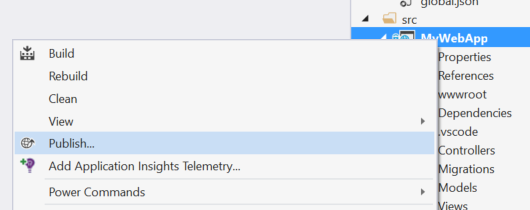
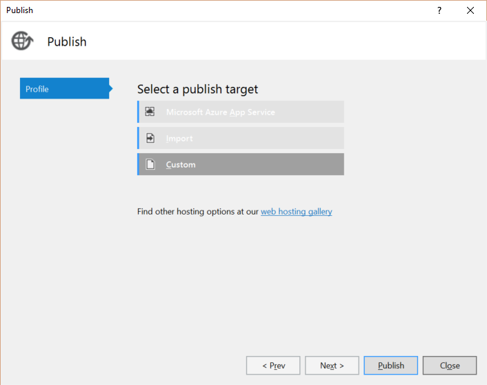
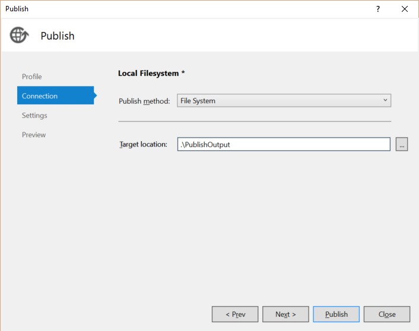
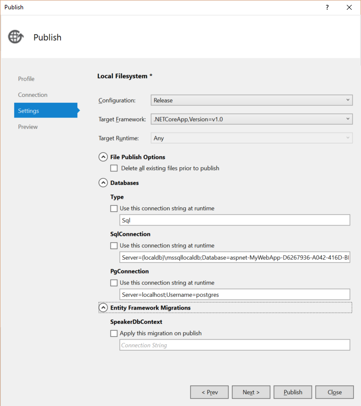
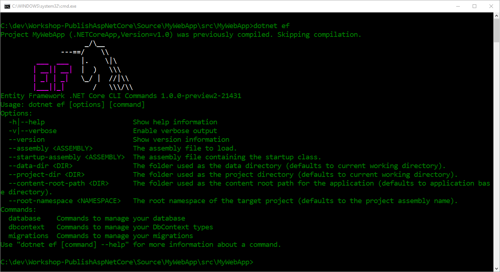
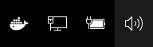
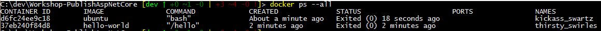
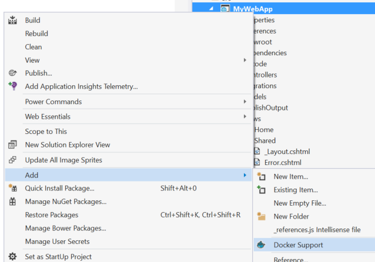

<a name="HOLTop" ></a>
# Publish, Deploy, and Docker with ASP.NET Core#

---

<a name="Overview" ></a>
## Overview ##

This workshop is designed to take you through some of the options you have available when configuring and deploying an application to a production-ready environment.  That could be a local web server, filesystem, Docker container, or the cloud. 

<a name="Objectives" ></a>
### Objectives ###
In this module, you'll see how to:

- Publish a web application using Visual Studio
- Apply Entity Framework Migrations to SQL Server
- Take advantage of Environment Variables to configure an application
- Get started with some Docker basics
- Use a Docker hosted database service with ASP.NET Core
- Publish to a Docker container
- Scale a Docker Container collection 

<a name="Prerequisites"></a>
### Prerequisites ###

The following is required to complete this module:

- [Visual Studio Community 2015][1] or greater OR [Visual Studio Code][4] 
- [ASP.NET Core 1.0][2]
- [Docker][3]

[1]: https://www.visualstudio.com/products/visual-studio-community-vs
[2]: https://dot.net/core
[3]: https://docker.com
[4]: https://code.visualstudio.com


> **Note:** You can take advantage of the [Visual Studio Dev Essentials]( https://www.visualstudio.com/en-us/products/visual-studio-dev-essentials-vs.aspx) subscription in order to get everything you need to build and deploy your app on any platform.

<a name="Setup" ></a>
### Setup ###
In order to run the exercises in this module, you'll need download the contents of this [repository from GitHub](https://github.com/csharpfritz/Workshop-PublishAspNetCore)

<a name="Exercises" ></a>
## Exercises ##
This module includes the following exercises:

1. [Build and Publish from Visual Studio](#Exercise1)
1. [Working with Entity Framework Migrations](#Exercise2)
1. [Use Environment Variables to configure an application](#Exercise3)
1. [Get Started with Docker Basics](#Exercise4)
1. [Switch to a Docker hosted Postgres database](#Exercise5)
1. [Publish to a Docker Container](#Exercise5)
1. [Scale Docker Containers](#Exercise6)


>**Note:** When you first start Visual Studio, you must select one of the predefined settings collections. Each predefined collection is designed to match a particular development style and determines window layouts, editor behavior, IntelliSense code snippets, and dialog box options. The procedures in this module describe the actions necessary to accomplish a given task in Visual Studio when using the **General Development Settings** collection. If you choose a different settings collection for your development environment, there may be differences in the steps that you should take into account.

<a name="Exercise1"></a>
### Exercise 1: Build and Publish from Visual Studio ###

<a name="Ex1Task1"></a>
#### Task 1 - Deploying a ASP.NET Core application to Azure ####

1. Open **Visual Studio Community 2015** and select **File | Open | Project / Soloution** and choose the **Source/MyWebApp.sln** solution file.

1. In the Solution Explorer, right-click **MyWebApp** and click **Publish**.

    

    _Publish Context Menu_

1. In the publish dialog, choose the **Custom** option

    

    _Custom Publish Option_

1. In the modal **New Custom Profile** dialog box, name your profile **Local Filesystem** and click **OK**  

1. Set the **Publish Method** to **File System** and the target location to **.\PublishOutput** and click **Next**

    

    _Configure the Publish Connection_

1. In the **Publish Settings** screen, apply the following settings and click **Publish**:

  * Configuration:  Release
  * Target Framework: .NETCoreApp, Version=v1.0
  * Target Runtime: Any

    

  _Publish Settings_

You should now see your **Output Window** open and the build process for the application.  The results of the build should be deposited in the **Source/MyWebApp/src/PublishOutput** folder.  Open a command-prompt and navigate to that folder and test your application by running:

    dotnet MyWebApp.dll

But... something went wrong, and there's a wonderfully helpful stack trace dumped all over your beautiful console window.  What went wrong?

<a name="#Exercise2"></a>
### Exercise 2: Entity Framework Migrations ###

Entity Framework Core has been updated and brings migrations to the cross-platform capabilities of .NET Core.  In this exercise, we're going to fix the problem from the previous exercise by applying our Entity Framework migrations and restarting the web server.

1.  Open a command-prompt and navigate to the **Source/MyWebApp/src/MyWebApp** folder.

1.  Execute the Entity Framework tools command with the dotnet command-line tool by typing:

    dotnet ef

You should be greeted by a helpful splashscreen of options and magic unicorns:



_Entity Framework Console Splash Screen_

<ol>
<li>The database that will be used is defined in the **appsettings.json** file as a value for the **SqlConnection** setting.  Apply the migrations to this instance of localdb with the command:<br/><br/>
    <code>dotnet ef database update</code>
<br/><br/>
The database should be created for you and updated with the configuration of the models defined in our sample project.</li>

<li>Browse back to the **PublishOutput** folder by executing the following command:

    <br/><br/><code>cd PublishOutput</code><br/><br/>

</li>

<li>Launch the web server with the command:
<br/><br/><code>dotnet MyWebApp.dll</code><br/><br/>

... and you should now be able to browse to the application at [http://localhost:5000](http://localhost:5000)

</li>

<a name="Exercise3"></a>
### Exercise 3: Use Environment Variables to Configure an Application ###

ASP.NET Core introduces improved support for controlling application behavior across multiple environments, such as development, staging, and production. Environment variables are used to indicate which environment the application is running in, allowing the app to be configured appropriately.

ASP.NET Core uses a particular environment variable, ASPNETCORE_ENVIRONMENT (or Hosting:Environment), to describe the environment the application is currently running in. This variable can be set to any value you like, but three values are used by convention: Development, Staging, and Production.

<a name="Ex3Task1"></a>
#### Task 1 - Output Environment Information ####

1. Open the `Views\Shared\_Layout.cshtml` file in your editor. Observe the `Environment` TagHelper which renders its content only if the active environment matches one of the values in the `names` attribute.

    ```html
    <environment names="Development">
        <link rel="stylesheet" href="~/lib/bootstrap/dist/css/bootstrap.css" />
        <link rel="stylesheet" href="~/css/site.css" />
    </environment>
    <environment names="Staging,Production">
        <link rel="stylesheet" href="https://ajax.aspnetcdn.com/ajax/bootstrap/3.3.6/css/bootstrap.min.css"
                asp-fallback-href="~/lib/bootstrap/dist/css/bootstrap.min.css"
                asp-fallback-test-class="sr-only" asp-fallback-test-property="position" asp-fallback-test-value="absolute" />
        <link rel="stylesheet" href="~/css/site.min.css" asp-append-version="true" />
    </environment>
    ```

1. At the top of the layout file, add the following line to inject the Hosting Environment service into your view.

    ```
    @inject Microsoft.AspNet.Hosting.IHostingEnvironment HostingEnvironment
    ```

1. Find the footer element in layout page and modify it to display the active environment.

    ```html
    <footer>
        <p>&copy; 2016 - WebApplicationBasic</p>
        <p> Env: @HostingEnvironment.EnvironmentName </p>
    </footer>
    ```

<a name="Ex3Task2"></a>
#### Task 2 - Create a Visual Studio Launch Profile ####

1. Right-click on the project in solution explorer and click on properties.

1. Select the **Debug** tab in the project properties window and click **New** button.

    

    _Create a new launch profile_

1. Name the new launch profile **IIS Express (Staging)**

1. In the **Launch** dropdown chose **IIS Express**

    

    _Launch IIS Express_

1. Add an **Environment Variable** named `Hosting:Environment` with a value of `Staging` and save the changes to your project properties.

    

    _Set Environment Variable_

1. In the **Debug** Dropdown, select **IIS Express (Staging)** and launch your application. You should now see the environment name displayed in the footer of your web application.

<a name="Exercise4"></a>
### Exercise 4: Get Started with Docker Basics

In this exercise, we will run our first Docker containers and verify that Docker Beta is running properly in our environment.  If Docker is started properly on your machine you should see a whale in the system tray:



_Docker Whale Icon in the System Tray_

With the latest beta of Docker for Windows and Mac, you should be able to have Docker containers running in the background while you are working in Visual Studio.  We can get started with Docker commands by opening a command prompt or a Powershell prompt and start executing commands with the Docker command-line tool.

1. Let's run our first Docker container with the command:

       docker run hello-world

   ... and you should have a nice message returned to you that verifies your Docker installation is working properly.

1. We can then go further and run a Ubuntu Linux container and access a shell within that container with the command:

       docker run -it ubuntu bash

   ... and you are now running Linux inside of a container on Windows.  The -it switch directs docker to start the container in **interactive mode** and to allocate a **terminal** for you to connect to.  The **ubuntu** argument is the name of the Docker image to start, and **bash** is the command to execute in the terminal we are connecting to.  
   
   Try some standard Linux commands to verify that you are truly operating in Linux.  When you are finished, execute the command `exit` to depart the Linux container.

1. Next, execute the following command to see the containers that we just ran:

       docker ps --all

   You will be greeted with a list of containers and their state.  

   

   _Docker container state_

   _Notice:_  Each container is listed as 'Exited'.  These containers are no longer running. Also, they all have random system generated names reported in the last column.

1. We can then remove these containers by executing the following command for each of the listed containers 

       docker rm d6f

   Where _d6f_ is the first three characters of the **CONTAINER ID** in the report.

<a name="Exercise5"></a>
### Exercise 5: Use a Docker hosted Postgres database ###

Now that we have Docker running, lets move our test database to a container so that we can start and stop it, move it to another host, and manage the database like it was a virtual machine.  

1. Start a postgres database container by executing the following command at a command-line:

       docker run -d -p 5432:5432 --name pg postgres

   That command should return a long hexadecimal number that is the CONTAINER ID of the container that was just started.  Lets break down what Docker tasks this command performed:

   * **run** started a new container from a _Docker Image_ called **postgres**  The image name is at the end of the command because all options must be declared first.  The postgres image was downloaded from the Docker Hub - a repository of Docker images available for the public to use and build on.
   * **-d** instructs Docker to run in disconnected mode.  This means it will start the container in the background and return control of the command-line to you.
   * **-p 5432:5432** declares that Docker needs to open a network port from the container to the host machine.  In this case, we are opening the port 5432 and passing it directly because that is the standard Postgres database port.  The format of this argument is in the form of  **host machine port** : **container port**
   * **--name pg** declares a name for the container instead of a system generated name.  In this case, _pg_ is an abbreviation for Postgres. 

1. We can reconfigure our application to use the Postgres database by modifying **appsettings.json** in the **src/MyWebApp** folder and setting the _ConnectionStrings:Type_ value to **Postgres**

      ```json
      {
          "ConnectionStrings": {
              "Type": "Postgres",
      ```

1. Apply migrations to the Postgres database the same way we did the SQL Server database:

       dotnet ef database update 

1. Update the footer of the **_Layout.cshtml** page to contain some additional information about the database type and the **HOSTNAME** environment variable:

      ```html
       <footer>
         <p>&copy; 2016 - WebApplicationBasic</p>
         <p> Env: @HostingEnvironment.EnvironmentName - @Config["HOSTNAME"] - @Config["ConnectionStrings:Type"]</p>
       </footer>
       ```
 
1. Launch the application from the **src/MyWebApp** folder with the command:

       dotnet run

   ... and then navigate your browser to the application at http://localhost:5000  Click through to the _Speaker List_ to see an Angular formatted grid with data presented from the Postgres database.

**BONUS CREDIT**

Examine the source code and determine where the speaker list is created and add your name and topic to the list.  Rebuild and run your application to verify you added yourself to the seed data properly.  

<a name="Exercise6"></a>
### Exercise 6: Publish Your Application to a Docker container ###

Next, we will add Docker support to our project which will allow us to manage the configuration of the application as it runs in the container through a series of configuration files.  This will also allow us to easily deploy a container with our application completely configured the way it should be run to another environment.

1. Right Click on the project name in the Solution Explorer and select **Add | Docker Support**

  

  _Add Docker Support to a Project_

1. Several files will be added to the project, and configuration updates applied to allow Visual Studio 2015 to work with the Docker container.  Get started running the application in a container by clicking the **Debug | Start** menu item to build, deploy to a container, and attach the Visual Studio debugger.

1. This will generate a docker-compose.yml file in your project.  We will update this file to control how our application is started and run inside of the container.  Modify the contents of the file to contain the following:

        version: '2'

        services:
        db:
          image: postgres
          ports:
            - "5432:5432"
        mywebapp:
          image: username/mywebapp
          environment:
            "ConnectionStrings:Type": Postgres
            "ConnectionStrings:PgConnection": Server=db;User ID=postgres;
          depends_on:
              - db
          ports:
            - "80:80"

    
1. Run a **Build | Build MyWebApp** from within Visual Studio 2015.  This will generate a Docker Image that we can use to create our containers.

1. From the command-line, let's start the collection of our database and web server with this command:

       docker-compose up -d

    This will start the containers and they will run in the background.  There is a quirk with the way that the containers start, because the web service depends on the Postgres database and the migrations are not applied, nor is the database ready to service the web requests.

1. Let's apply the entity framework migrations to the Postgres container with the command:

        dotnet ef database update

1. Restart the web service in the docker cluster with the command:

        docker-compose scale mywebapp=1    


At this point, you should be able to navigate to http://localhost and see the results of your docker containers running.

**BONUS**

Update your **docker-container.yml** file to contain the following to enable a load-balancer and the ability to scale your web application:


        version: '2'

        services:
        db:
          image: postgres
          ports:
            - "5432:5432"
        lb:
          image: dockercloud/haproxy
          links:
            - mywebapp
          volumes:
            - /var/run/docker.sock:/var/run/docker.sock
          ports:
            - "80:80"
            - "1936:1936"
        mywebapp:
          image: username/mywebapp
          environment:
            "ConnectionStrings:Type": Postgres
            "ConnectionStrings:PgConnection": Server=db;User ID=postgres;
          depends_on:
              - db

---

<a name="Summary" ></a>
## Summary ##

By completing this module, you should have:

- Published and deployed a Web Application to aDocker Container using Visual Studio
- Changed behavior of your app based on different deployment environments
- Worked with composing multiple Docker containers 
